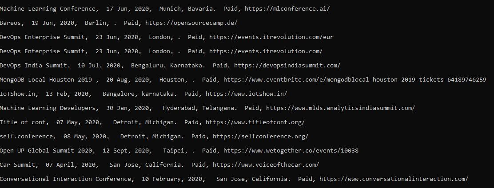
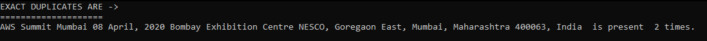
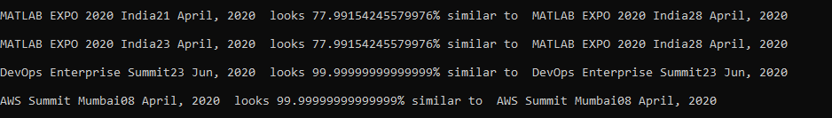

# Python script to Display conferences and find duplicate, semantic duplicate ones

## Packages to install before executing

- requests - `pip install requests`
- sklearn - `pip install sklearn`
- nltk - `pip install nltk`

## Displaying conferences as human readable format

## Displaying Exact Duplicates

## Displaying Semantic Duplicates

